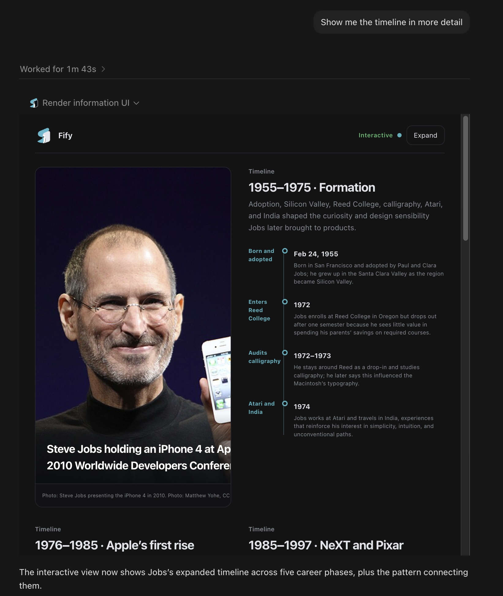

# Fify plugin marketplace

Fify turns grounded AI answers into trusted interactive comparisons, plans, checklists, timelines, and decision views. It preserves the complete plain-language answer as an authoritative fallback and performs no consequential actions.



This repository is a Git-backed marketplace for Codex. The plugin is self-contained: it requires Node.js 20 or newer, performs no separate npm or pnpm install, asks users for no Fify account or end-user API key, and runs a bundled deterministic information-view compiler locally.

## Install in Codex

```bash
codex plugin marketplace add renfei-design/fify-plugin
codex plugin add fify@fify
```

Start a new Codex task after installation, then ask normally or tag `@Fify`:

- Compare these options by cost and risk.
- Make this rollout plan a checklist I can work through.
- Show these milestones as a timeline.

The repository is the marketplace. No package installation, Fify account, or end-user API key is required.

## Use with ChatGPT

This Git marketplace cannot be added directly as a user-defined ChatGPT marketplace. You can still use Fify in ChatGPT through a developer-mode MCP connection:

1. Open **Settings → Security and login** and enable **Developer mode**.
2. Open the ChatGPT Plugins page and select the plus button.
3. Name the connection **Fify** and use the public MCP endpoint below.
4. Review the discovered read-only tool, create the connection, and add it to a new chat.

`https://fify-chatgpt.renfei1992.chatgpt.site/api/mcp`

Developer mode availability depends on the user's account and workspace policy. Public discovery across ChatGPT and Codex requires publication to OpenAI's universal plugin directory. This repository is the Codex distribution source and the hosted endpoint is the direct ChatGPT connection source; neither makes Fify automatically discoverable in ChatGPT. See OpenAI's [connection guide](https://developers.openai.com/plugins/deploy/connect-chatgpt) and [plugin packaging guide](https://developers.openai.com/plugins/build/plugins).

## Use from another MCP client

Fify also exposes a public Streamable HTTP MCP endpoint for compatible clients:

`https://fify-chatgpt.renfei1992.chatgpt.site/api/mcp`

The tool always returns a complete plain-language fallback. The inline interactive view requires a host that supports the MCP Apps UI extension.

See [MARKETPLACE_LISTING.md](./MARKETPLACE_LISTING.md) for verified listing metadata, capabilities, limitations, and submission copy.

## What is included

- A Codex plugin manifest and Fify information-UI skill.
- A bundled local MCP server with `render_information_ui`.
- Product screenshots, activation evals, and reviewer cases.
- Validation and end-to-end protocol smoke tests.
- Official MCP Registry metadata for the public remote endpoint.

The local compiler does not research or verify facts. Codex supplies the grounded answer and sources, and Fify validates and renders that material. The bundled server limits each host identity to 20 successful renders per UTC day and two concurrent renders.

## Verify locally

```bash
npm run check
```

See [BUILD_PROVENANCE.md](./BUILD_PROVENANCE.md) for the public bundle boundary and [SECURITY.md](./SECURITY.md) for reporting guidance.

## License

Apache-2.0. Bundled dependency notices are in [THIRD_PARTY_NOTICES.md](./THIRD_PARTY_NOTICES.md).
